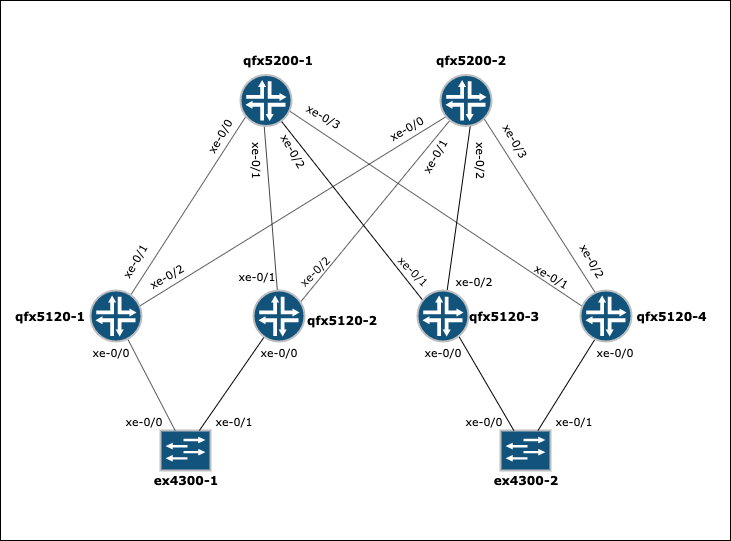
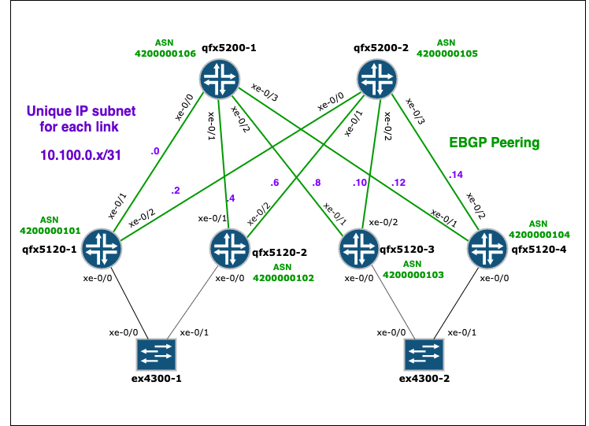

# DRY Ansible for Network Automation

__DRY Ansible for Network Automation (DANA)__ is a collection of Ansible roles and playbooks that allow you to provision,
 sketch and backup your Junos OS network without the need of manually describing the details of your topology.
 
This is achieved by leveraging a topology inspection role that automatically discovers and represents every links, 
nodes and interfaces of a particular group in the inventory file. 
In this way, you don't have to write down a separate YAML file to represent the target topology.

Don't Repeat Yourself (DRY) is the core paradigm driving this project:

* __it is DRY__ : by breaking down atomic operations into Ansible roles that are then conveniently combined and reused 
across easily consumable playbooks;
* __it keeps you DRY__: by freeing you from providing anything that can be automatically figured out about 
your network topology.

Complete list of Features:

* Inspect the network topology and automatically represent links and interfaces
* Generate and provision OSPF underlay configuration
* Generate and provision EBGP underlay configuration 
* Generate and provision multiple LAGs configuration 
* Backup all active configurations
* Push multiple configuration files 

For further details, please check the usage section below


## Quick Start Example - EBGP Underlay Provisioning

Suppose you spent few hours in the lab cabling up the following network topology for testing purposes.

 
 
The devices only got your Lab default configuration, which includes management and loopback interfaces.  
 
Your ultimate goal is to configure an IP Fabric by provisioning:

* The underlay IP connectivity on all fabric links, 
* EBGP as underlay routing protocol with one private ASN per device to redistribute the loopback addresses across 
the fabric,
* Load balancing 

The playbook _pb_provision_ebgp_underlay_ is what you need:

1. Create a group called `ip_underlay` in your inventory file (_hosts.ini_) in which you include the devices that must be 
part of the fabric (this will be the only input from your side)

    ```
    # hosts.ini
    
    [ip_underlay]
    qfx5120-1
    qfx5120-2 
    qfx5120-3
    qfx5120-4
    qfx5200-1
    qfx5200-2
    ```

2. Run the playbook:

    ```
    ansible-playbook pb_provision_ebgp_underlay.yml -i hosts.ini -t push_config
    ```

    The tag `push_config` just tells the playbook to both generate and commit the configuration to the remote devices. 
    You can omit this tag if you only want to generate the files locally. They will be stored in a folder 
    _\_ebgp_underlay_config_ in your inventory directory.

3. Enjoy the final result!



A quick summary of what just happened:

1. Links and neighbours connecting the members of the ip_underlay group have been automatically discovered, while Links 
to devices outside the group have been safely ignored;
2. IP addresses, interfaces, ASN have been automatically generated from default seed values (that can be customised);
3. A configuration file for each device involved has been generated accordingly, stored in a local folder and finally 
pushed to the remote devices.

You can find out more about how the discovery is carried out and how you can tune the default variables to suite your 
needs in the Usage section of the documentation below.

The leaf device qfx5120-1 in this example will be provisioned with the following configuration:

```
interfaces {
    xe-0/0/1 {
        mtu 9216;
        unit 0 {
            family inet {
                address 10.100.0.0/31;
            }
        }
    }
    xe-0/0/2 {
        mtu 9216;
        unit 0 {
            family inet {
                address 10.100.0.2/31;
            }
        }
    }
}
```


```
protocols {
    bgp {
        group ebgp-underlay {
                type external;
                family inet {
                unicast;
                }
                multipath {
                    multiple-as;
                }
                export pl-local_loopback;
                local-as 4200000101;
    
                neighbor 10.100.0.1 {
                    description qfx5200-1;
                    peer-as 4200000106;
                }
                neighbor 10.100.0.3 {
                    description qfx5200-2;
                    peer-as 4200000105;
                }
            }
        }
}
```


```

policy-options {
    policy-statement pl-local_loopback {
        term 1 {
            from {
                protocol direct;
                interface lo0.0;
            }
            then accept;
        }
    }

    policy-statement ECMP {
        then {
            load-balance per-packet;
        }
    }
}

routing-options {
    forwarding-table {
        export ECMP;
    }
}
```


## Installation 

### Virtualenv
To execute the playbooks locally it is recommended to run the project in a virtual environment. The following steps
describe the installation using Anaconda: 

1. Clone the repository 
2. Install Python 3.7
3. Install [Anaconda](https://docs.conda.io/projects/conda/en/latest/user-guide/install/index.html) 
4. Create a virtual environment with the requested Python version

```
conda create --name dry_ansible_venv python=3.7
```
5. Activate the virtual environment 
    
```
conda activate dry_ansible_venv
```

6. Install the requirements 
    
```
pip install -r requirements.txt
```

## Usage

Each individual operation is defined as a custom Ansible role. Roles are reused across different ready-to-use playbooks.

You can use this project in two ways:

* Run one of the playbooks;
* Write your own playbook and import one or more roles.


### Playbooks

* [pb_backup_config.yml](/docs/playbook-docs/pb_backup_config_README.md)
* [pb_sketch_topology.yml](docs/playbook-docs/pb_sketch_topology_README.md)
* [pb_provision_ip_underlay.yml](docs/playbook-docs/pb_provision_ip_underlay_README.md)
* [pb_provision_ebgp_underlay.yml](/docs/playbook-docs/pb_provision_ebgp_underlay_README.md)
* [pb_provision_ospf_underlay.yml](/docs/playbook-docs/pb_provision_ospf_underlay_README.md)
* [pb_push_config.yml](/docs/playbook-docs/pb_push_config_README.md)
* [pb_provision_lag.yml](/docs/playbook-docs/pb_provision_lag_README.md)


### Roles

* [dana_junos_topology_inspector](roles/dana_junos_topology_inspector/README.md)
* [dana_junos_push_config](roles/dana_junos_push_config/README.md)
* [dana_junos_backup_config](roles/dana_junos_backup_config/README.md)
* [dana_topology_diagram](roles/dana_topology_diagram/README.md)
* [dana_junos_ip_underlay](roles/dana_junos_ip_underlay/README.md)
* [dana_junos_ebgp_underlay](roles/dana_junos_ebgp_underlay/README.md)
* [dana_junos_ospf_underlay](roles/dana_junos_ospf_underlay/README.md)
* [dana_junos_lag](roles/dana_junos_lag/README.md)