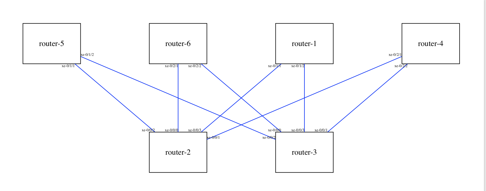
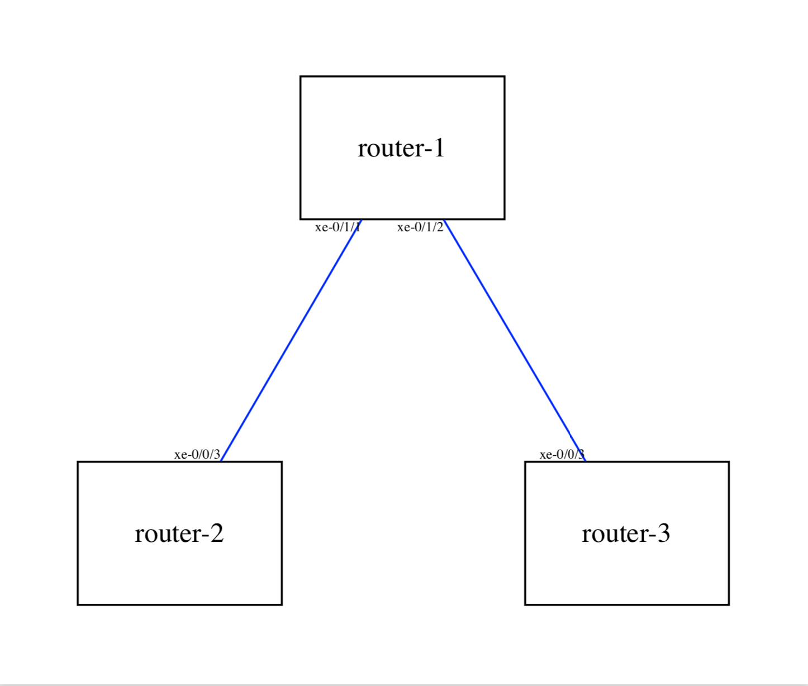

# DRY Ansible for Network Automation

The fewer variables you need to care about the easier Automation you can carry out!

__DRY Ansible for Network Automation (DANA)__ is a collection of Ansible roles and playbooks that allow you to provision,
 sketch and backup your Junos OS network, with no need of manually describing the details of your topology, or pre-enable any 
 discovery protocol by hand.
 
This is achieved by leveraging a topology inspection role that automatically discovers and represents every links, 
nodes and interfaces of a particular group in the inventory file. 
In this way, you don't have to write down a separate YAML file to represent the target topology.


Don't Repeat Yourself (DRY) is the core paradigm driving this project:

* __it is DRY__ : by breaking down atomic operations into Ansible roles that are then conveniently combined and reused 
across easily consumable playbooks;
* __it keeps you DRY__: by freeing you from providing anything that can be automatically figured out about 
your network topology.

Complete list of Features:

* [Sketch topology diagram and export as PDF](#usage-sketch)
* [Generate and provision OSPF underlay configuration] 
* Generate and provision EBGP underlay configuration 
* Generate and provision multiple LAGs configuration 
* Backup all active configurations

For further details, please check the usage section below


## Quick Start Example - EBGP Underlay Provisioning

Suppose you spent few hours in the lab cabling up the following network topology for testing purposes.

 
 
The devices only got your Lab default configuration, which includes management and loopback interfaces.  
 
Your ultimate goal is to configure an IP Fabric by provisioning:

* The underlay IP connectivity on all fabric links, 
* EBGP as underlay routing protocol with one private ASN per device to redistribute the loopback addresses across 
the fabric,
* Load balancing 

The playbook _pb_provision_ebgp_underlay_ is what you need:

1. Create a group called `ip_underlay` in your inventory file (_hosts.ini_) in which you include the devices that must be 
part of the fabric (this will be the only input from your side)

    ```
    # hosts.ini
    
    [ip_underlay]
    qfx5120-1
    qfx5120-2 
    qfx5120-3
    qfx5120-4
    qfx5200-1
    qfx5200-2
    ```

2. Run the playbook:

    ```
    ansible-playbook pb_provision_ebgp_underlay.yml -i hosts.ini -t push_config
    ```

    The tag `push_config` just tells the playbook to both generate and commit the configuration to the remote devices. 
    You can omit this tag if you only want to generate the files locally. They will be stored in a folder 
    _\_ebgp_underlay_config_ in your inventory directory.

3. Enjoy the final result!


A quick summary of what just happened:

1. Links and neighbours connecting the members of the ip_underlay group have been automatically discovered, while Links 
to devices outside the group have been safely ignored;
2. IP addresses, interfaces, ASN have been automatically generated from default seed values (that can be customised);
3. A configuration file for each device involved has been generated accordingly, stored in a local folder and finally 
pushed to the remote devices.

You can find out more about how the discovery is carried out and how you can tune the default variables to suite your 
needs in the Usage section of the documentation below.

The leaf device qfx5120-1 in this example will be provisioned with the following configuration:

```
interfaces {
    xe-0/0/1 {
        mtu 9216;
        unit 0 {
            family inet {
                address 10.100.0.0/31;
            }
        }
    }
    xe-0/0/2 {
        mtu 9216;
        unit 0 {
            family inet {
                address 10.100.0.2/31;
            }
        }
    }
}
```


```
protocols {
    bgp {
        group ebgp-underlay {
                type external;
                family inet {
                unicast;
                }
                multipath {
                    multiple-as;
                }
                export pl-local_loopback;
                local-as 4200000101;
    
                neighbor 10.100.0.1 {
                    description qfx5200-1;
                    peer-as 4200000106;
                }
                neighbor 10.100.0.3 {
                    description qfx5200-2;
                    peer-as 4200000105;
                }
            }
        }
}
```


```

policy-options {
    policy-statement pl-local_loopback {
        term 1 {
            from {
                protocol direct;
                interface lo0.0;
            }
            then accept;
        }
    }

    policy-statement ECMP {
        then {
            load-balance per-packet;
        }
    }
}

routing-options {
    forwarding-table {
        export ECMP;
    }
}
```


## Installation 

### Virtualenv
To execute the playbooks locally it is recommended to run the project in a virtual environment. The following steps
describe the installation using Anaconda: 

1. Clone the repository 
2. Install Python 3.7
3. Install [Anaconda](https://docs.conda.io/projects/conda/en/latest/user-guide/install/index.html) 
4. Create a virtual environment with the requested Python version

```
conda create --name dry_ansible_venv python=3.7
```
5. Activate the virtual environment 
    
```
conda activate dry_ansible_venv
```

6. Install the requirements 
    
```
pip install -r requirements.txt
```

## Usage

Each individual operation is defined as an Ansible role which are teh building blocks that can be easily reused and 
combined across different playbooks you may need to write. 

The project also exposes a variety of playbooks ready to use.

### Roles

The list of roles:

* [dana_junos_topology_inspector](roles/dana_junos_topology_inspector/README.md)
* [dana_junos_push_config](roles/dana_junos_push_config/README.md)
* [dana_junos_backup_config](roles/dana_junos_backup_config/README.md)
* [dana_topology_diagram](roles/dana_topology_diagram/README.md)
* [dana_junos_ip_underlay](roles/dana_junos_ip_underlay/README.md)
* [dana_junos_ebgp_underlay](roles/dana_junos_ebgp_underlay/README.md)
* [dana_junos_ospf_underlay](roles/dana_junos_ospf_underlay/README.md)
* [dana_junos_lag](roles/dana_junos_lag/README.md)


### Playbooks


#### <a name="usage-sketch"></a> Sketch Topology Diagram

Playbook: pb_sketch_topology.yml

This playbook discovers the network topology (or a subset of it) and sketches nodes, links and interfaces which are 
drawn in a topology diagram exported as PDF.
 
##### Requirements 

The playbook relies on the following roles:

* [dana_junos_topology_inspector](roles/dana_junos_topology_inspector/README.md)
* [dana_topology_diagram](roles/dana_topology_diagram/README.md)

You can check the requirements on roles' documentation.

##### Example 1

We assume you have an inventory folder structured as following:

```
inventory
├── group_vars
├── host_vars
└── hosts.ini
```

Your `hosts.ini` looks like this

```
# invenotry/hosts.ini

router-1
router-2
router-3
router-4
router-5
router-6
```

You can run the playbook with no input variables:

```
ansible-playbook pb_sketch_topology.yml -i invenotry/hosts.ini 
```


The output is a PDF file with a draft of your topology diagram that displays all nodes, links and interface names.

The PDF is stored in a folder _topology_diagram automatically created  in your inventory directory:
```
inventory
├── _topology_diagram
│   ├── topology_diagram.dot
│   └── topology_diagram.pdf
```

The topology_diagram.pdf will display a sketch of the topology like this:


##### Example 2

To target a subset of devices:

1. Create a group in your inventory file

    ```
    # invenotry/hosts.ini 
    
    [my_subset]
    router-1
    router-2
    router-3
    ```

2. Set the variable `grouo_to_inspect` to the group name just created.
This will make sure that only links connecting the members of the group will be discovered:

    ```yaml
    # invenotry/group_vars/all.yml
    
    group_to_inspect: my_subset
    ```
3. Run the playbook targeting the desired group
  
    ```
    ansible-playbook pb_sketch_topology.yml -i inventory/hosts.ini -e "targets=my_subset"
    ```
    
The topology_diagram.pdf will display a sketch of the selected subset of the topology like this:




##### Complete List of Variables

Playbook variables:

* _targets_ (default value = `all`): it is the _hosts_ parameter of the playbook, used to set the target hosts. 
It can be a group name or a device name

For role variables, refer to

* [dana_junos_topology_inspector](roles/dana_junos_topology_inspector/README.md)
* [dana_topology_diagram](roles/dana_topology_diagram/README.md)


#### Provision OSPF Underlay 

Playbook: _pb_provision_ospf_underlay.yml_

This playbook first discovers the network topology, then generates the Junos configuration for underlay IP connectivity 
and OSPF over the physical interfaces to redistribute the loopback addresses.

##### Requirements

The playbook relies on the following roles:

* [dana_junos_topology_inspector](roles/dana_junos_topology_inspector/README.md)
* [dana_junos_ip_underlay](roles/dana_junos_ip_underlay/README.md)
* [dana_junos_ospf_underlay](roles/dana_junos_ospf_underlay/README.md)
* [dana_junos_push_config](roles/dana_junos_push_config/README.md)

Please check the requirements on roles' documentation.

##### Example 1

1. Create a group called `ip_underlay` in your inventory file whose members are the devices you want to be part of 
the OSPF underaly:

    ```
    # invenotry/hosts.ini 
    
    [ip_underlay]
    router-1
    router-2
    router-3
    ```
2. Run the playbook 

    ```
    ansible-playbook pb_provision_ospf_underlay.yml -i invenotry/hosts.ini
    ```

Result: The interfaces connecting the devices are configured with IP and OSPF. Files are stored in the following folder:

```
inventory
├── _ospf_underlay_configs
│   ├── ospf_underlay.router-1.conf
│   ├── ospf_underlay.router-2.conf
│   ├── ospf_underlay.router-3.conf
│   ├── ip_underlay.router-1.conf
│   ├── ip_underlay.router-2.conf
│   └── ip_underlay.router-3.conf
```

Each link is automatically configured with a different IP subnet.

Example of output configuration:

```
# ip_underlay.router-1.conf

interfaces {
    xe-0/0/1 {
        mtu 9216;
        unit 0 {
            family inet {
                address 10.100.0.0/31;
            }
        }
    }
    xe-0/0/2 {
        mtu 9216;
        unit 0 {
            family inet {
                address 10.100.0.2/31;
            }
        }
    }
}
```
```
# ospf_underlay.router-1.conf

protocols {
    ospf {
        area 0.0.0.0 {
            interface lo0.0 passive;
            
            interface xe-0/0/1.0 {
            interface-type p2p;
            }
            interface xe-0/0/2.0 {
            interface-type p2p;
            }
        }
    }
}
```


If you also want to push the configuration to the remote devices, run the playbook with the tag `push_config`

```
ansible-playbook pb_provision_ospf_underlay.yml -i invenotry/hosts.ini -t push_config
```

This will load (with _replace_ mode) and commit the configurations on the respective devices.

##### Example 2

Suppose you already have a group called `net_core` that you wish to provision:

```
# invenotry/hosts.ini 

[net_core]
router-1
router-2
router-3
```

You can modify the variable `underlay_group` to be the desired target group:

1. Edit the variable to match that name:

    ```yaml
    # invenotry/group_vars/all.yml
    
    underlay_group: net_core
    ```

2. Run the playbook targeting that group

    ```
    ansible-playbook pb_provision_ospf_underlay.yml -i invenotry/hosts.ini -e "targets=net_core"
    ```

The output is analogous to the previous example.


##### Complete List of Variables

Playbook variables:

* _targets_ (default value = `ip_underlay`): it is the _hosts_ parameter of the playbook, used to set the target hosts. 
It can be a group name or a device name

Role Variables:

* [dana_junos_topology_inspector](roles/dana_junos_topology_inspector/README.md)
* [dana_junos_ip_underlay](roles/dana_junos_ip_underlay/README.md)
* [dana_junos_ospf_underlay](roles/dana_junos_ospf_underlay/README.md)
* [dana_junos_push_config](roles/dana_junos_push_config/README.md)


#### Provision EBGP Underlay 

Playbook: _pb_provision_ebgp_underlay.yml_

This playbook first discovers the network topology, then generates the Junos configuration for underlay IP connectivity 
and EBGP peering over the physical interfaces to redistribute the loopback addresses.


##### Example 1 - Minimal

1. Create a group called `ip_underlay` in your inventory file whose members are the devices you want to be part of 
the EBGP underaly:

    ```
    # invenotry/hosts.ini 
    
    [ip_underlay]
    router-1
    router-2
    router-3
    ```
2. Run the playbook:

    ```
    ansible-playbook pb_provision_ebgp_underlay.yml -i invenotry/hosts.ini
    ```
    

Result: Generate IP and EBGP configuration files and store them in the following folder:

```
inventory
├── _ebgp_underlay_configs
│   ├── ebgp_underlay.router-1.conf
│   ├── ebgp_underlay.router-2.conf
│   ├── ebgp_underlay.router-3.conf
│   ├── ip_underlay.router-1.conf
│   ├── ip_underlay.router-2.conf
│   └── ip_underlay.router-3.conf
```

Example of output configuration 

```
# ip_underlay.router-1.conf

interfaces {
    xe-0/0/1 {
        mtu 9216;
        unit 0 {
            family inet {
                address 10.100.0.0/31;
            }
        }
    }
    xe-0/0/2 {
        mtu 9216;
        unit 0 {
            family inet {
                address 10.100.0.2/31;
            }
        }
    }
}
```

```
# ebpg_underlay.router-1.conf

protocols {
    bgp {
        group ebgp-underlay {
                type external;
                family inet {
                unicast;
                }
                multipath {
                    multiple-as;
                }
                export pl-local_loopback;
                local-as 4200000101;
    
                neighbor 10.100.0.1 {
                    description router-2;
                    peer-as 4200000102;
                }
                neighbor 10.100.0.3 {
                    description router-3;
                    peer-as 4200000103;
                }
            }
        }
}

policy-options {
    policy-statement pl-local_loopback {
        term 1 {
            from {
                protocol direct;
                interface lo0.0;
            }
            then accept;
        }
    }

policy-statement ECMP {
        then {
            load-balance per-packet;
        }
    }
}

routing-options {
    forwarding-table {
        export ECMP;
    }
}
```

##### Example 3 - Specify AS Numbers

The Autonomous System Numbers (ASNs) are generated incrementally starting from a default value `4200000100`. 
You can change the seed value by modifying the variable `asn_start`. Example:

```yaml
# invenotry/group_vars/all.yml

asn_start: 65000
```
    
##### Complete List of Variables


#### Provision LAG interfaces


##### Example 1 


##### Example 2

##### Complete List of Variables


#### Backup Active Configurations 

Playbook: pb_backup_config.yml

This playbook backup all the active configurations of the target devices and collect them in a folder.
File names contain the corresponding device name, a timestamp and an optional label.


##### Example 1 - Basic

Run the playbook (By default, all the inventory hosts are targeted. You can be more selective by providing the variable
 `targets`):
 
```
ansible-playbook pb_backup_config.yml -i invenotry/hosts.ini
```

Output: 

```
inventory
├── _backup_configs
│   ├── 2020-01-01_1200.router-1.conf
│   ├── 2020-01-01_1200.router-2.conf
│   ├── 2020-01-01_1200.router-3.conf
│   ├── 2020-01-01_1200.router-4.conf
│   ├── 2020-01-01_1200.router-5.conf
│   └── 2020-01-01_1200.router-6.conf
```

##### Example 2 -No Timestamps

By default, the current timestamp is included in the file name, but you can exclude it setting the variable 
`include_timestamp`:

```yaml
# inventory/group_vars/all.yml

include_timestamp: no
```

Output: 

```
inventory
├── _backup_configs
│   ├── router-1.conf
│   ├── router-2.conf
│   ├── router-3.conf
│   ├── router-4.conf
│   ├── router-5.conf
│   └── router-6.conf
```

##### Example 3 - Custom Labels

You can prepend a custom label to the configuration file name by editing:

```yaml
# inventory/group_vars/all.yml

config_label: MY-SETUP
```

Output: 

```
inventory
├── _backup_configs
│   ├── MY-SETUP.2020-01-01_1200.router-1.conf
│   ├── MY-SETUP.2020-01-01_1200.router-2.conf
│   ├── MY-SETUP.2020-01-01_1200.router-3.conf
│   ├── MY-SETUP.2020-01-01_1200.router-4.conf
│   ├── MY-SETUP.2020-01-01_1200.router-5.conf
│   └── MY-SETUP.2020-01-01_1200.router-6.conf
```

You can of course be more specific and set different labels for different devices with group or individual host 
granularity. You simply need to set the variables in the right place:

```
# inventory/hosts.ini

router-1
router-2

[my_core]
router-3
router-4

[my_access]
router-5
router-6
```

```yaml
# inventory/group_vars/all.yml

config_label: GENERIC
```

```yaml
# inventory/group_vars/my_core.yml

config_label: MY-CORE
```

```yaml
# inventory/group_vars/my_access.yml

config_label: MY-ACCESS
```

```yaml
# inventory/host_vars/router-1.yml

config_label: MY-BEST-ROUTER
```

Run the playbook:

```
ansible-playbook pb_backup_config.yml -i inventory/hosts.ini 
```

Output: 

```
inventory
├── _backup_configs
│   ├── MY-BEST-ROUTER.2020-01-01_1200.router-1.conf
│   ├── GENERIC.2020-01-01_1200.router-2.conf
│   ├── MY-CORE.2020-01-01_1200.router-3.conf
│   ├── MY-CORE.2020-01-01_1200.router-4.conf
│   ├── MY-ACCESS.2020-01-01_1200.router-5.conf
│   └── MY-ACCESS.2020-01-01_1200.router-6.conf
```

##### Complete List of Variables

Playbook variables:

* _targets_ (default value = `all`): it is the _hosts_ parameter of the playbook, used to set the target hosts. 
It can be a group name or a device name

Role Variables:

* [dana_junos_backup_config](roles/dana_junos_topology_inspector/README.md)
